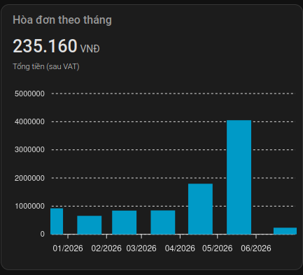
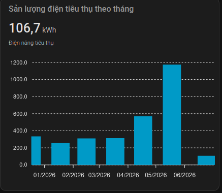
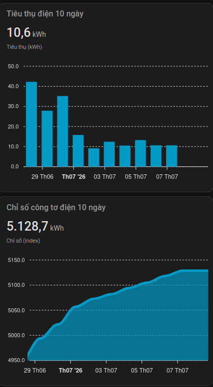
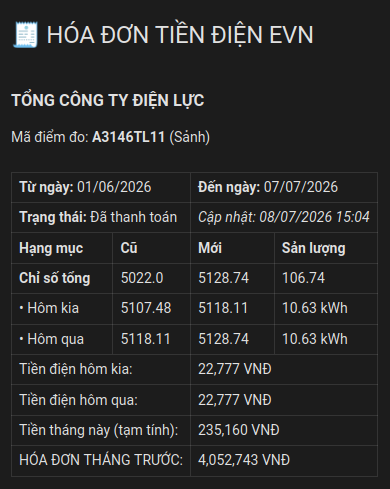

[![hacs][hacs-badge]][hacs-repo]
[![Project Maintenance][maintenance-badge]][maintenance]

## Công cụ theo dõi điện năng tiêu thụ EVN qua eAgent dành cho HomeAssistant

> **Dựa trên** [nestup_evn](https://github.com/trvqhuy/nestup_evn) của [@trvqhuy](https://github.com/trvqhuy) — cảm ơn tác giả vì đã xây dựng nền tảng open-source cho cộng đồng HA Việt Nam.

Integration này sử dụng API quốc gia **eAgent** (`gateway.dienluc.vn`) thay vì các endpoint riêng lẻ theo vùng, cho phép theo dõi điện năng tiêu thụ trực tiếp trên UI [Home Assistant](https://www.home-assistant.io) mà không cần chọn chi nhánh EVN.

### Điểm khác biệt so với nestup_evn

| | nestup_evn | eagent_dienlucvn |
|---|---|---|
| API | 5 endpoint riêng theo vùng | 1 API quốc gia `gateway.dienluc.vn` |
| Thiết lập | Mã KH → Tài khoản → Ngày bắt đầu HĐ | Tài khoản + Mật khẩu + Mã KH (1 bước) |
| Chọn khu vực | Cần chọn chi nhánh | Tự động phát hiện qua API |
| Chu kì cập nhật | 6 giờ | 1–24 giờ (mặc định 3 giờ, tùy chỉnh được) |
| Lịch sử hóa đơn | Không | Có (toàn bộ, kèm QR code thanh toán) |
| Lịch sử chỉ số | Không | Có (10 ngày gần nhất) |

### Các tính năng

1. Thiết lập **một bước duy nhất** — chỉ cần tài khoản eAgent + mã khách hàng.
2. Hỗ trợ **toàn quốc** qua API eAgent mà không phân biệt vùng miền.
3. Theo dõi **nhiều mã khách hàng** đồng thời.
4. **Chu kỳ cập nhật tùy chỉnh** từ 1 đến 24 giờ, thay đổi được sau khi cài đặt mà không cần xóa integration.
5. Tương thích với tất cả platform HA: **Core**, **Supervisor**, **Hass OS**.
6. **Lịch sử hóa đơn đầy đủ** theo tháng kèm QR code thanh toán ngân hàng.
7. **Lịch sử chỉ số 10 ngày** gần nhất để vẽ biểu đồ tiêu thụ.

### Sensors được tạo

Entity ID có dạng `sensor.{ma_khach_hang}_{key}` (tất cả viết thường).

| Sensor | Ý nghĩa | Đơn vị |
|---|---|---|
| `econ_daily_new` | Sản lượng ngày mới nhất | kWh |
| `econ_daily_old` | Sản lượng ngày trước đó | kWh |
| `ecost_daily_new` | Tiền điện ngày mới nhất (tham khảo) | VNĐ |
| `ecost_daily_old` | Tiền điện ngày trước đó (tham khảo) | VNĐ |
| `econ_monthly` | Sản lượng tháng hiện tại | kWh |
| `ecost_monthly` | Tiền điện tháng (tham khảo) | VNĐ |
| `econ_total_new` | Chỉ số công tơ mới nhất ★ | kWh |
| `econ_total_old` | Chỉ số công tơ đầu kỳ | kWh |
| `from_date` | Ngày đầu kỳ hóa đơn | — |
| `to_date` | Ngày tạm chốt (cập nhật mới nhất) | — |
| `payment_status` | Tình trạng thanh toán ★ | — |
| `bill_amount` | Số tiền hóa đơn gần nhất ★ | VNĐ |
| `latest_update` | Thời điểm cập nhật dữ liệu lần cuối | — |

> ★ Sensor có **attributes mở rộng** — xem chi tiết bên dưới.
>
> Các sensors tiền điện (`ecost_*`) được tính theo biểu giá bán lẻ sinh hoạt + 8% VAT, chỉ mang tính **tham khảo**.

### Attributes mở rộng

Các sensor đánh dấu ★ chứa thêm dữ liệu trong phần **Attributes** (xem tại Developer Tools → States hoặc dùng trong template/automation):

**`payment_status`** — thông tin khách hàng:
- `customer_name`, `address`, `phone`, `meter` (số công tơ), `station`, `new_code`

**`bill_amount`** — chi tiết hóa đơn gần nhất:
- `period`, `issue_date`, `from_date`, `to_date`
- `consumption_kwh`, `amount_before_tax`, `tax`
- `bill_type`, `order_code`, `bank`
- `qr_code` — nội dung QR code VietQR để thanh toán qua ngân hàng
- `history` — danh sách **toàn bộ hóa đơn** các tháng trước (mỗi phần tử có đầy đủ các trường trên kèm `qr_code`)

**`econ_total_new`** — lịch sử chỉ số:
- `meter_no` — số serial công tơ
- `history` — danh sách **10 ngày gần nhất**, mỗi phần tử: `{date, index, consumption}`

## Yêu cầu trước khi cài đặt

### 1. Phiên bản Home Assistant: tối thiểu 2022.7.0

### 2. Tài khoản eAgent

Tải app **eAgent** hoặc đăng ký tại [eagent.vn](https://eagent.vn). Tài khoản bao gồm:
- **Tên đăng nhập**: thường là số điện thoại đăng ký với EVN.
- **Mật khẩu**: mật khẩu tài khoản eAgent.

### 3. Mã khách hàng

Mã khách hàng điện (`customerCode`) có trên hóa đơn điện hàng tháng hoặc trong app eAgent phần thông tin hợp đồng.

### 4. Loại công tơ được hỗ trợ

Chỉ hỗ trợ công tơ **điện tử đo xa ghi theo ngày**. Nếu bạn xem được **sản lượng theo ngày** trên app eAgent thì công tơ của bạn tương thích.

## Cài đặt

### Cách 1: Thêm nhanh qua HACS (khuyến nghị)

Nhấn nút bên dưới để thêm repository này vào HACS ngay lập tức:

[](https://my.home-assistant.io/redirect/hacs_repository/?owner=mkbyme&repository=hacs-eagent-dienlucvn&category=integration)

Sau khi tải xong, **khởi động lại HomeAssistant**, rồi tiến hành [Thiết lập](#thiết-lập) phía dưới.

---

Hoặc thêm thủ công:
> HACS > Integrations > ⋮ > Custom repositories > `https://github.com/mkbyme/hacs-eagent-dienlucvn` > Category: Integration

### Cách 2: Cài đặt thủ công qua Samba / SFTP

1. Tải phiên bản mới nhất từ [GitHub Releases](https://github.com/mkbyme/hacs-eagent-dienlucvn/releases).

2. Sao chép thư mục `custom_components/eagent_dienlucvn` vào thư mục `custom_components` của HomeAssistant.

    ```
    └── configuration.yaml
    └── custom_components
        └── eagent_dienlucvn
            └── __init__.py
            └── sensor.py
            └── eagent_dienlucvn.py
            └── config_flow.py
            └── const.py
            └── types.py
            └── manifest.json
            └── ...
    ```

3. Khởi động lại HomeAssistant.

## Thiết lập

Sau khi cài đặt, nhấn nút bên dưới để thêm integration trực tiếp vào HomeAssistant của bạn:

[](https://my.home-assistant.io/redirect/config_flow_start/?domain=eagent_dienlucvn)

Hoặc tìm thủ công: **Settings > Devices & Services > Add Integration** → tìm `eAgent Điện lực Việt Nam`.

Điền thông tin trong **một bước duy nhất**:
- **Tài khoản**: số điện thoại đăng ký eAgent
- **Mật khẩu**: mật khẩu eAgent
- **Mã khách hàng**: mã khách hàng điện (ghi trên hóa đơn)
- **Chu kỳ cập nhật dữ liệu**: số giờ giữa các lần lấy dữ liệu từ API (1–24, mặc định 3)

Sau khi xác nhận, các sensors sẽ xuất hiện trong phần Devices.

### Thay đổi chu kỳ cập nhật sau khi cài đặt

Vào **Settings → Devices & Services → eAgent Điện lực Việt Nam → Configure** để chỉnh lại chu kỳ mà không cần xóa và cài lại integration.

## Biểu đồ (ApexCharts)

Thư mục [`charts/`](charts/) chứa các file YAML mẫu dùng với card [apexcharts-card](https://github.com/RomRider/apexcharts-card) (cài qua HACS → Frontend):

| File | Nội dung |
|---|---|
| `charts/bill_by_month.yaml` | Tiền hóa đơn theo tháng (cột) |
| `charts/consumption_by_month.yaml` | Sản lượng kWh/tháng (cột) |
| `charts/daily_10days.yaml` | Sản lượng kWh/ngày + chỉ số tích lũy (10 ngày gần nhất) |
| `charts/dashboard_evn.yaml` | Dashboard tổng hợp: thẻ hóa đơn dạng "tờ hóa đơn" + cả 3 biểu đồ trên |

**Cách dùng**: Thay `CUSTOMER_CODE` trong file bằng mã khách hàng của bạn (viết thường), sau đó dán nội dung vào Lovelace dạng **Manual card**.

### Xem trước

| Hóa đơn theo tháng | Sản lượng theo tháng |
|---|---|
|  |  |

| Tiêu thụ & chỉ số 10 ngày | Thẻ tóm tắt hóa đơn (dashboard) |
|---|---|
|  |  |

## Home Assistant — Ví dụ Automation

Thay `{ma_khach_hang}` bằng mã khách hàng thực tế của bạn (viết thường).

```yaml
alias: Thông báo điện năng tiêu thụ mỗi ngày
mode: single

trigger:
  - platform: time
    at: "08:00:00"

condition:
  - condition: template
    value_template: >-
      {{ states('sensor.{ma_khach_hang}_to_date') == (now() - timedelta(days=1)).strftime('%d/%m/%Y') }}

action:
  - service: notify.notify
    data:
      title: Điện tiêu thụ hôm qua
      message: >
        Ngày {{ states('sensor.{ma_khach_hang}_to_date') }}:
        {{ '\n' }}- Sản lượng: {{ states('sensor.{ma_khach_hang}_econ_daily_new') }} kWh
        {{ '\n' }}- Thành tiền: {{ '{0:_.0f}'.format(states('sensor.{ma_khach_hang}_ecost_daily_new')|int).replace('_','.') }} VNĐ
        {{ '\n' }}- Sản lượng tháng: {{ states('sensor.{ma_khach_hang}_econ_monthly') }} kWh
```

### Ví dụ lấy QR code hóa đơn (trong template)

```yaml
# Lấy QR code thanh toán của hóa đơn gần nhất
{{ state_attr('sensor.{ma_khach_hang}_bill_amount', 'qr_code') }}

# Lấy tên khách hàng
{{ state_attr('sensor.{ma_khach_hang}_payment_status', 'customer_name') }}

# Lấy sản lượng ngày đầu tiên trong lịch sử 10 ngày
{{ state_attr('sensor.{ma_khach_hang}_econ_total_new', 'history')[0]['consumption'] }} kWh
```

## Giá bán lẻ điện (sinh hoạt, có VAT 8%)

| Bậc | Mức tiêu thụ (kWh) | Giá (VNĐ/kWh) |
|---|---|---|
| 1 | 0 – 50 | 1.984 |
| 2 | 51 – 100 | 2.050 |
| 3 | 101 – 200 | 2.380 |
| 4 | 201 – 300 | 2.998 |
| 5 | 301 – 400 | 3.350 |
| 6 | 401+ | 3.460 |

> Xem biểu giá chính thức tại [evn.com.vn](https://www.evn.com.vn/c3/evn-va-khach-hang/Bieu-gia-ban-le-dien-9-79.aspx).

## Lời cảm ơn

Integration này được xây dựng dựa trên nền tảng của **[nestup_evn](https://github.com/trvqhuy/nestup_evn)** — công trình open-source của [@trvqhuy](https://github.com/trvqhuy).

> Không có `nestup_evn`, repo này sẽ không tồn tại như một integration dành cho cộng đồng HA Việt Nam.

[hacs]: https://github.com/custom-components/hacs
[hacs-badge]: https://img.shields.io/badge/HACS-custom-0468BF.svg?style=for-the-badge
[hacs-repo]: https://github.com/mkbyme/hacs-eagent-dienlucvn
[maintenance-badge]: https://img.shields.io/badge/maintainer-%40mkbyme-F2994B?style=for-the-badge
[maintenance]: https://github.com/mkbyme
